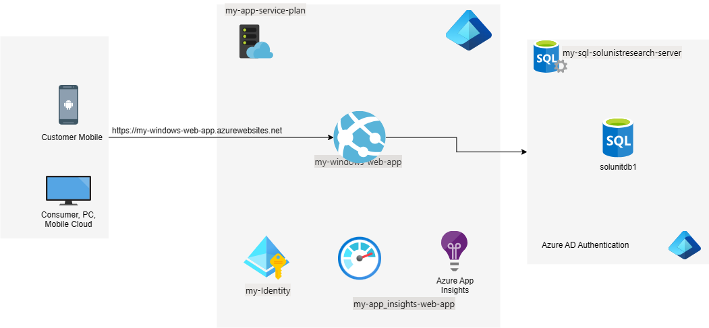

# Infrastructure
## Requirements

| Name | Version |
|------|---------|
|  [terraform](#requirement\_terraform) | >= 1.0 |
|  [azurerm](#requirement\_azurerm) | >=4.0.0 |

## Providers

No providers.

## Modules

| Name | Source | Version |
|------|--------|---------|
|  [app\_insights](#module\_app\_insights) | git::https://github.com/sumersovitkargit/Central_Terraform_Modules.git//App_Insight | main |
|  [app\_service\_plan](#module\_app\_service\_plan) | git::https://github.com/sumersovitkargit/Central_Terraform_Modules.git//App_Service_Plan | main |
|  [azurerm\_windows\_web\_app](#module\_azurerm\_windows\_web\_app) | git::https://github.com/sumersovitkargit/Central_Terraform_Modules.git//App_Service_Windows | main |
|  [resource\_group](#module\_resource\_group) | git::https://github.com/sumersovitkargit/Central_Terraform_Modules.git//Resource_group | main |
|  [sql\_databases](#module\_sql\_databases) | git::https://github.com/sumersovitkargit/Central_Terraform_Modules.git//sql_db | main |
|  [sql\_server](#module\_sql\_server) | git::https://github.com/sumersovitkargit/Central_Terraform_Modules.git//Sql_Server | main |
|  [user\_assigned\_identity](#module\_user\_assigned\_identity) | git::https://github.com/sumersovitkargit/Central_Terraform_Modules.git//User_managed_Identity | main |

## Resources

No resources.

## Inputs

| Name | Description | Type | Default | Required |
|------|-------------|------|---------|:--------:|
|  [administrator\_login](#input\_administrator\_login) | The login for the Azure AD administrator. | `string` | n/a | yes |
|  [administrator\_object\_id](#input\_administrator\_object\_id) | The object ID of the Azure AD administrator. | `string` | n/a | yes |
|  [app\_insights\_name](#input\_app\_insights\_name) | The name of the Application Insights resource. | `string` | n/a | yes |
|  [app\_service\_name](#input\_app\_service\_name) | The name of the Windows Web App | `string` | n/a | yes |
|  [app\_service\_plan\_name](#input\_app\_service\_plan\_name) | The name for the App Service Plan. | `string` | n/a | yes |
|  [application\_type](#input\_application\_type) | The name of the Resource Group where Application Insights will be created. | `string` | n/a | yes |
|  [databases](#input\_databases) | Map of SQL databases to create, with optional collation and edition | <pre>map(object({     collation = optional(string)     edition   = optional(string)   }))</pre> | `{}` | no |
|  [identity\_name](#input\_identity\_name) | The name of the Application Insights resource. | `string` | n/a | yes |
|  [location](#input\_location) | Location for the Resource Group. | `string` | `"East US"` | no |
|  [os\_type](#input\_os\_type) | The O/S type for the App Services to be hosted in this plan. | `string` | n/a | yes |
|  [resource\_group\_name](#input\_resource\_group\_name) | Name of the Resource Group to be created. | `string` | n/a | yes |
|  [sku\_name](#input\_sku\_name) | The SKU name for the App Service Plan. | `string` | n/a | yes |
|  [sql\_server\_name](#input\_sql\_server\_name) | The name of the Azure SQL Server. | `string` | n/a | yes |
|  [tags](#input\_tags) | Tags for the Resource Group. | `map(string)` | `{}` | no |
|  [tags\_asp](#input\_tags\_asp) | A mapping of tags which should be assigned to the AppService. | `map(string)` | `{}` | no |

## Outputs

| Name | Description |
|------|-------------|
|  [app\_insights\_connection\_string](#output\_app\_insights\_connection\_string) | n/a |
|  [app\_insights\_instrumentation\_key](#output\_app\_insights\_instrumentation\_key) | n/a |
|  [created\_database\_ids](#output\_created\_database\_ids) | Database IDs created by the SQL Database module |
|  [created\_database\_names](#output\_created\_database\_names) | Database Names created by the SQL Database module |
|  [identity\_id](#output\_identity\_id) | The ID of the User-Assigned Managed Identity. |
|  [identity\_principal\_id](#output\_identity\_principal\_id) | The principal ID of the User-Assigned Managed Identity. |
|  [resource\_group\_id](#output\_resource\_group\_id) | The ID of the Resource Group |
|  [resource\_group\_name](#output\_resource\_group\_name) | The Name of the Resource Group |
|  [sql\_server\_fully\_qualified\_domain\_name](#output\_sql\_server\_fully\_qualified\_domain\_name) | The fully qualified domain name of the SQL Server. |
|  [sql\_server\_id](#output\_sql\_server\_id) | The ID of the Azure SQL Server. |
